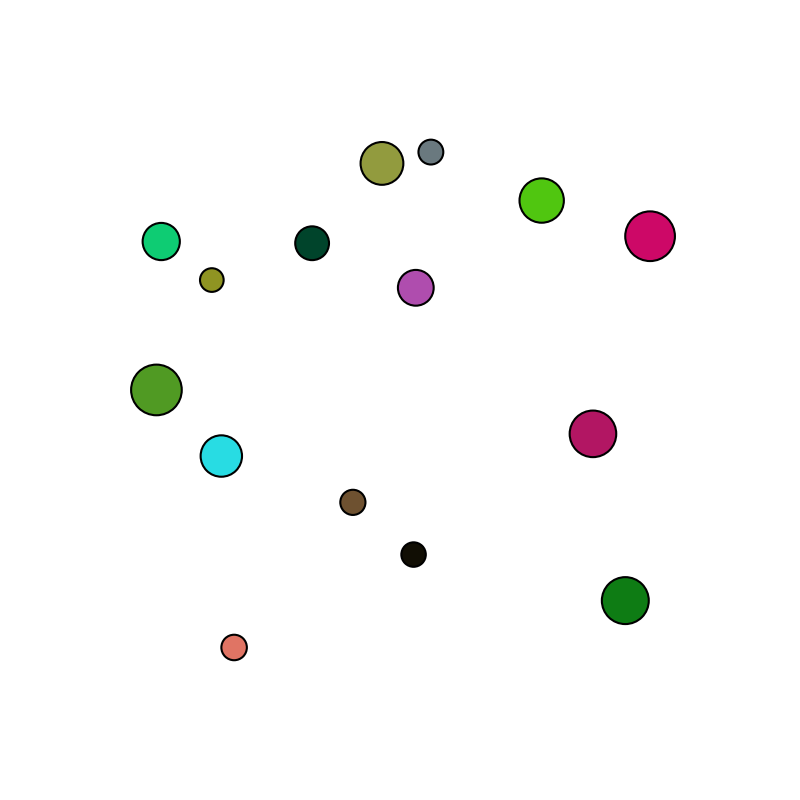

# 🎯 Dynamic Projectile Targeting under Real-Life Disruptive Forces

## 📌 Description

This project focuses on simulating projectile motion under real-world 
forces such as **gravity** and **drag**. The governing equations are formulated as ordinary differential equations (ODEs) and solved using the shooting method to determine the optimal velocity for hitting static and moving targets.

**Written in Python** , this project utilizes advanced techniques such as **edge detection**, **clustering**, **shooting method** and  **numerical methods** like **Euler** and **RK2**, all packaged in the `utils` module.

For a more detailed explanation, visit my documentation:
📚 [Dynamic Projectile Targeting Docs](https://komachavariani.notion.site/Dynamic-Projectile-Targeting-Docs-1a317eee0cbb80e1ad42cbe573a3c82f)

### 🧮 Governing Equations
```math
\frac{dx}{dt} = v_x,
```

```math
\frac{dy}{dt} = v_y,
```

``` math
\frac{dv_x}{dt} = -\frac{k}{m} v_x \sqrt{v_x^2 + v_y^2},
```

``` math
\frac{dv_y}{dt} = -g - \frac{k}{m} v_y \sqrt{v_x^2 + v_y^2}.
```

## 🔥 Project Components

### 🎯 1. Shooting Static Targets

- A **stationary shooter** aims at targets identified in an input image.  
- **Edge detection** & **clustering** help locate targets.  
- **The shooting method** computes the **optimal velocity** to hit them.
- Topped with **visualizations & animations**!✨

#### Example:
- **Animation Demonstration:** [YouTube Video](https://www.youtube.com/watch?v=Uh1eYqLn54Y)
- <div>
    <table>
      <tr>
        <th>Input Image</th>
        <th>Computed Trajectories</th>
      </tr>
      <tr>
        <td></td>
        <td></td>
      </tr>
    </table>
  </div>

  
### 🚀 2. Intercepting a Moving Target

- The system predicts the motion path of a moving object.
- Optimal projectile velocity is calculated to intercept the target.
- Visualizations and animations enhance the analysis.

#### Example:
- **Input Video:** [YouTube Video](https://www.youtube.com/watch?v=1OYyFiDLVnA)
- <div>
    <table>
      <tr>
        <th>Real Path vs. Prediction</th>
        <th>Interceptions Visualization</th>
      </tr>
      <tr>
        <td></td>
        <td></td>
      </tr>
    </table>
  </div>

 
- **Interceptions Animation:** [YouTube Video](https://www.youtube.com/watch?v=-qYOM2z-txw) ✨

## ⚙️ Installation & Usage

### 📜 Prerequisites

- Python 3.x
- Required libraries: NumPy, OpenCV, Matplotlib

## License

This project is licensed under the MIT License.

